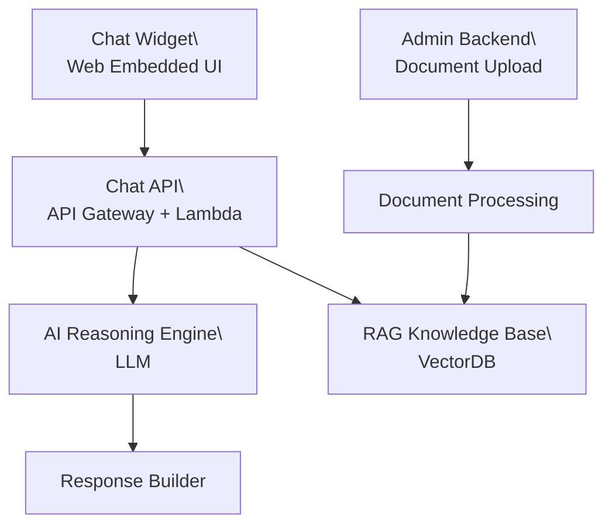

# 需求规格说明书

**Document Version:** 1.0
**Status:** Draft
**Author:** Andy
**Project Name:** AstraChat — AWS Serverless AI Customer Service Demo

## 1 Project Overview

### 1.1 Purpose

AstraChat 项目的目标是展示开发者在以下核心技能的工程化能力：

- AWS Serverless 架构设计与部署能力
- LLM（大语言模型）推理调用链路设计能力
- RAG（Retrieval-Augmented Generation）知识库实现能力
- 前端可嵌入 Web 的 AI 客服组件开发能力
- 云存储、向量数据库、API 设计的综合能力

### 1.2 Project Description

AstraChat 是一个可嵌入任意网页（如外贸公司官网）的 AI 智能客服系统。

系统使用 AWS Serverless 架构，具备：

- 网页聊天组件（Chat Widget）
- API Gateway + Lambda 后端
- AI 推理服务（OpenAI / Claude / AWS Bedrock）
- RAG 知识库流程（PDF / Word → 向量索引 → 检索）
- S3 文件存储
- 简易 Admin 文档上传界面

系统主要用于展示开发者在 AI + Cloud 的全链路开发能力，而非构建完整商业 SaaS。

### 1.3 Goals & Objectives

#### 1.3.1 Primary Goals

- 展示 AWS Lambda + API Gateway 的实际工程能力
- 展示 LLM 调用链、Prompt 架构、上下文管理能力
- 展示完整 RAG pipeline（Chunking → Embedding → VectorDB → Retrieval）
- 实现可嵌入任何网站的前端聊天组件
- 实现文档上传并自动加入知识库

#### 1.3.2 Secondary Goals

- 展示基础 Web API 设计能力
- 展示 AWS IAM、KMS、S3 的安全实践
- 支持中英双语自动识别与回复
- 完成可供演示的 Demo 页面

### 1.4 System Scope

#### 1.4.1 In Scope（必须实现）

- Chat Widget（网页嵌入聊天窗口）
- REST Chat API（API Gateway + Lambda）
- 调用 LLM（OpenAI / Claude / Bedrock）
- RAG（文档上传 → Chunking → Embedding → 检索）
- S3 文档存储
- DynamoDB 存储会话与文档信息
- Admin 后台（文档上传）

#### 1.4.2 Out of Scope（不实现）

- 用户登录与权限系统
- 多租户 SaaS 功能
- 客服转人工系统
- 高级前端界面 / 动画
- 报表分析功能
- 产品 SKU 复杂逻辑
- WebSocket 实时聊天（后续可扩展 SSE）

### 1.5 Deliverables

#### 1.5.1 Source Code（GitHub）

- /frontend/chat-widget
- /backend/lambda
- /rag/
- /deploy/cdk/
- README（完整说明）
- 架构图（PNG / SVG）
- RAG 流程图
- API 文档

#### 1.5.2 Documents

- 01_project_overview.md
- 02_system_architecture.md
- 03_functional_requirements.md
- 04_module_design/*.md
- 05_deployment_guide.md
- API Specification
- RAG System Overview

#### 1.5.3 Media

- YouTube：Demo + 架构讲解视频
- Demo 截图套装

### 1.6 Definitions & Abbreviations

| Term      | Definition                           |
| --------- | ------------------------------------ |
| LLM       | Large Language Model                 |
| RAG       | Retrieval Augmented Generation       |
| API       | Application Programming Interface    |
| AWS       | Amazon Web Services                  |
| S3        | Simple Storage Service               |
| Lambda    | AWS Serverless Compute               |
| REST      | Representational State Transfer      |
| Embedding | 向量化表示，用于相似度检索           |
| VectorDB  | 向量数据库，如 OpenSearch / Pinecone |

## 2 Functional Requirements

### 2.1 Functional Overview

本章定义 AstraChat 系统必须提供的全部功能需求，用于指导后续系统架构与模块设计。 系统由五个主要功能模块组成：

1. **Chat Widget**（前端嵌入式聊天组件）
2. **Chat API**（API Gateway + Lambda 后端接口）
3. **AI Reasoning Engine**（大语言模型推理服务）
4. **RAG Knowledge Base**（检索增强生成系统）
5. **Admin Backend**（简易后台，用于文档上传）

### 2.2 Use Cases

**UC-01 — 用户发起聊天**

| 项目                 | 内容                                                         |
| -------------------- | ------------------------------------------------------------ |
| **Actor**            | Visitor（访客）                                              |
| **Precondition**     | Chat Widget 已加载在网页上                                   |
| **Trigger**          | 用户输入消息并点击发送                                       |
| **Main Flow**        | 1. 用户输入文本消息2. 点击发送按钮3. Widget 调用 /chat API4. 后端 Lambda 触发 RAG + LLM 推理5. 前端展示回复 |
| **Postcondition**    | 对话记录写入 DynamoDB                                        |
| **Alternative Flow** | 网络错误、LLM 调用失败 → 返回错误信息                        |

**UC-02 — 管理员上传文档**

| 项目                 | 内容                                                         |
| -------------------- | ------------------------------------------------------------ |
| **Actor**            | Admin                                                        |
| **Precondition**     | 管理员访问 Upload 页面                                       |
| **Trigger**          | 点击上传按钮                                                 |
| **Main Flow**        | 1. 选择本地 PDF/Word 文件2. 前端调用 /upload API3. 后端写入 S34. Lambda 启动 RAG 文档解析5. 显示上传成功 |
| **Postcondition**    | 文档向量写入 VectorDB                                        |
| **Alternative Flow** | 文件格式不支持 / 超过大小限制                                |

**UC-03 — 系统构建向量知识库（RAG Pipeline）**

| 项目                 | 内容                                                         |
| -------------------- | ------------------------------------------------------------ |
| **Actor**            | 系统（Lambda 自动执行）                                      |
| **Trigger**          | 文档上传成功后自动触发                                       |
| **Main Flow**        | 1. 从 S3 下载文档2. 文本抽取（PDF → text）3. Chunk 切片（如 200–500 tokens）4. 调用 Embedding API5. 写入向量数据库（OpenSearch/Pinecone） |
| **Alternative Flow** | 文档解析失败 → 返回错误日志                                  |

**UC-04 — 用户查询触发 RAG 检索**

| 项目                 | 内容                                                         |
| -------------------- | ------------------------------------------------------------ |
| **Actor**            | Visitor                                                      |
| **Trigger**          | 用户提出与文档相关的问题                                     |
| **Main Flow**        | 1. 后端对 query 生成 embedding2. 检索向量数据库 top-k3. 整合内容注入 LLM4. 返回生成结果 |
| **Alternative Flow** | 无可检索文档 → 降级为纯 LLM 回复                             |

### 2.3 Functional Module List（功能模块列表）

#### 2.3.1 **Chat Widget**

- 输入消息
- 展示 AI 回复
- 管理 sessionId
- 多语言自动识别

#### 2.3.2 **Chat API**

- 接收前端请求
- 负责对话管理
- 调用 RAG 与 LLM

#### 2.3.3 **AI Reasoning Engine**

- Prompt 模板生成
- LLM 推理
- Token 管理

#### 2.3.4 **RAG Knowledge Base**

- 文档上传 → S3
- 文本解析
- Chunking
- Embedding
- 向量数据库检索

#### 2.3.5 **Admin Backend**

- 文档上传界面
- 文档列表展示

### 2.4 Functional Overview Diagram（功能模块关系图）



### 2.5 Input / Output Definitions（输入输出定义 — 规范化格式）

#### 2.5.1 Chat API Input

**Response Code:** `200 OK`

| 字段         | 类型   | 说明                                 |
| ------------ | ------ | ------------------------------------ |
| `session_id` | string | 前端会话唯一标识，多轮对话保持上下文 |
| `message`    | string | 用户输入的自然语言消息               |
| `language`   | string | auto / en / zh（不填写则自动识别）   |

**示例请求：

```json
{

  "session_id": "abc123",

  "message": "What products do you offer?",

  "language": "auto"

}
```

#### **2.5.2 Chat API Output**

**Response Code:** `200 OK`

| 字段      | 类型   | 说明                             |
| --------- | ------ | -------------------------------- |
| `reply`   | string | AI 最终回复文本                  |
| `sources` | array  | RAG 检索到的文档片段             |
| `usage`   | object | token 使用情况（可用于性能测试） |

`sources` 子结构：

| 字段     | 类型   | 说明             |
| -------- | ------ | ---------------- |
| `doc_id` | string | 文档唯一 ID      |
| `chunk`  | string | 被引用的文本内容 |

**示例：**

```json
{

  "reply": "We offer X, Y and Z products.",

  "sources": [

​    { "doc_id": "p1", "chunk": "Product catalog..." }

  ],

  "usage": {

​    "prompt_tokens": 185,

​    "completion_tokens": 42,

​    "total_tokens": 227

  }

}
```

**错误响应（规范化标准格式）：**

```json
{

  "error": {

​    "code": "LLM_TIMEOUT",

​    "message": "The AI model did not respond in time.",

​    "retryable": true

  }

}
```


#### 2.5.3 Upload API Input

**Endpoint:** `POST /upload`

| 字段   | 类型   | 必填 | 约束            | 说明       |
| ------ | ------ | ---- | --------------- | ---------- |
| `file` | binary | Yes  | PDF/Word, ≤ 5MB | 上传的文档 |

**支持文件类型：**

- `.pdf`
- `.docx`

**非功能需求约束（NFR 关联）：**

- 文件大小 ≤ 5MB
- 上传耗时 ≤ 5 秒

#### **2.5.4 Upload API Output**

| 字段      | 类型   | 说明                             |
| --------- | ------ | -------------------------------- |
| `status`  | string | 固定为 `success` 或 `failed`     |
| `file_id` | string | 文档唯一 ID（用于后续 RAG 检索） |

**成功示例：**

{

  "status": "success",

  "file_id": "doc_20250101_001"

}

**失败示例：**

{

  "status": "failed",

  "error": "FILE_TOO_LARGE"

}

### 2.6 Acceptance Criteria

- 聊天窗口可正常在网页显示

- 输入消息后能成功收到 AI 回复

- 文档上传成功后可被 RAG 检索

- 系统能够引用文档内容回答问题

- 所有 API 可部署并运行于 AWS

- GitHub 文档完整、可复现

## 3  Non-Functional Requirements (NFR)

### 3.1 Purpose

本章独立定义 AstraChat 系统的 **非功能性需求（Non-Functional Requirements）**，用于补充 SRS 功能需求范围之外的系统质量、性能、安全、可靠性等约束指标。

此章作为单独文件，便于在架构设计、性能测试、上线验收中作为独立依据使用。

### 3.2 Performance Requirements（性能需求）

- 单次聊天响应时间 ≤ **2.5s**（包含 RAG + LLM）
- 文档上传与处理完成时间 ≤ **10s**（≤5MB）
- 系统支持 **≥100 并发请求**，AWS Serverless 自动扩展
- API 可用性 ≥ **99.9%**
- 请求失败重试机制（网络类错误自动重试一次）

### 3.3 Security Requirements（安全需求）

- API Key 必须使用 **AWS KMS 加密**管理
- 所有密钥不允许在前端暴露
- IAM 权限遵循 **最小权限原则（Least Privilege）**
- 文件上传限制：仅允许 `.pdf`/`.docx`，大小 ≤ **5MB**
- 所有输入必须经过校验，防止注入与恶意输入
- Lambda 运行环境隔离，禁止写入本地磁盘

### 3.4 Reliability Requirements（可靠性）

- Lambda 超时自动终止，避免死循环
- RAG 检索失败自动降级为纯 LLM 回复
- 所有错误需返回 **结构化 JSON**
- CloudWatch 必须记录：错误日志、延迟、并发量、吞吐量

### 3.5 Scalability Requirements（可扩展性）

- AI 模型可替换：OpenAI / Claude / AWS Bedrock
- VectorDB 可替换：Pinecone / OpenSearch / Weaviate
- 前后端解耦，可独立扩展
- 支持未来增加多语言或更多文档类型

### 3.6 Maintainability Requirements（可维护性）

- 所有模块独立可替换（LLM、RAG、Widget）
- 代码需遵循统一的目录结构与命名规范
- 日志与监控指标必须可视化（CloudWatch Dashboard）
- 需提供部署脚本（如 AWS CDK）

### 3.7 Usability Requirements（可用性）

- Chat Widget 必须易于嵌入任何网页
- 自动语言识别（中/英）
- Admin 页面提供简单的文件上传界面
- AI 回复必须可读、流畅，避免模型幻觉

### 3.8 Compliance Requirements（合规性）

- 用户聊天数据不得泄漏到前端
- 上传的文档不得被第三方服务存储（除 embedding 必需处理）
- 所有数据传输使用 HTTPS

## 4. User Characteristics（用户类型）

- **访客（Visitor）**：浏览网页并通过 Chat Widget 提问。
- **管理员（Admin）**：上传文档并维护知识库。
- **系统（System）**：执行自动化 RAG 解析与 AI 推理流程。

## 5. Assumptions & Dependencies（假设与依赖）

- 系统运行依赖 AWS Serverless（Lambda、API Gateway、S3、OpenSearch）。
- 前端网页需允许嵌入 JavaScript Chat Widget。
- LLM（OpenAI / Claude / Bedrock）API 必须可用。
- 网络环境需支持 HTTPS 外网访问。
- 上传文档必须为 PDF/DOCX 且内容可被解析。

## 6. Future Enhancements（未来扩展）

- 支持多语言 RAG（如日语、西班牙语）。
- 支持图像理解（Vision + Chat）。
- 支持语音聊天（Speech-to-Text + TTS）。
- 提供企业级后台（权限管理、多租户、多知识库）。
- 支持文档版本控制与自动更新。
