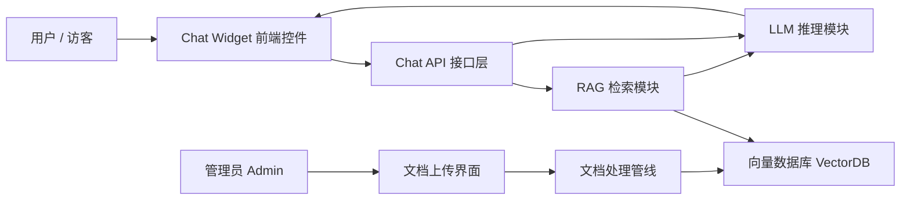
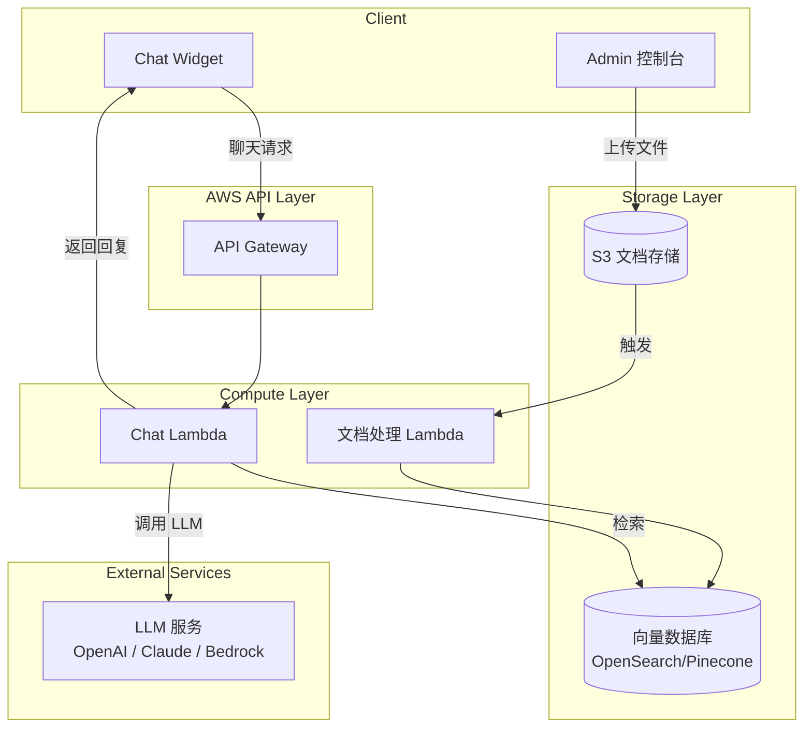
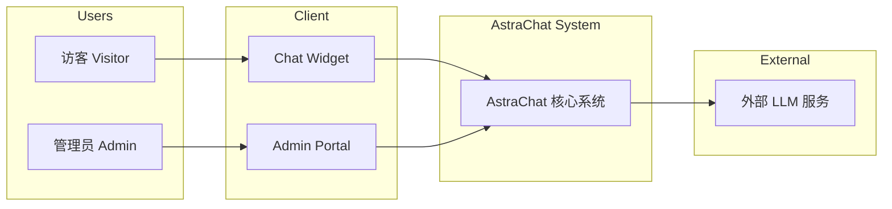
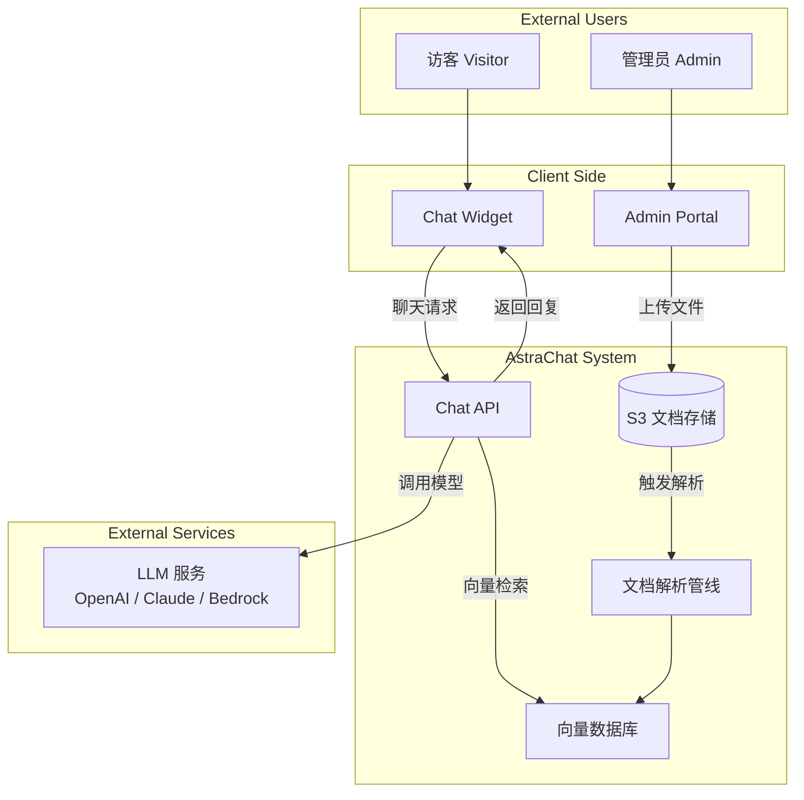

# 系统架构设计文档

**Document Version:** 1.0
**Status:** Draft
**Author:** Andy
**Project Name:** AstraChat — AWS Serverless AI Customer Service Demo

## 1 引言（Introduction）

​	本系统架构设计文档（SAD）用于描述 AstraChat 项目的整体技术架构，包括系统逻辑结构、部署结构、关键组件交互方式、安全设计、可扩展策略以及数据流动方式。本文件将作为后续系统开发、部署、扩展的技术参考标准。

SAD 的目标是：

- 为开发人员提供清晰明确的架构蓝图
- 为需求文档（SRS）提供技术落地依据
- 为部署与运维提供结构化指导
- 支撑未来系统扩展与功能增强

## 2 架构目标（Architecture Objectives）

AstraChat 的架构设计遵循以下核心目标：

### **2.1 无服务器优先（Serverless First）**

利用 AWS Lambda、API Gateway、S3、OpenSearch 等服务，实现零运维、按量计费、自动伸缩。

### **2.2 高可伸缩性（High Scalability）**

能够支持并发访问场景，满足企业客服系统的峰值压力，通过 AWS Serverless 自动扩展能力实现弹性伸缩。

### **2.3 低延迟（Low Latency）**

RAG 检索 + LLM 回复的整体响应时间需控制在 2.5 秒以内。

### **2.4 模块化（Modularity）**

LLM 模型、向量数据库、前端 Widget 等组件可独立替换。

### **2.5 安全与合规（Security & Compliance）**

遵循 IAM 最小权限原则、KMS 加密、HTTPS 通信、文档隐私保护等安全标准。

### **2.6 高可靠性（Reliability）**

包括错误降级、超时保护、多 AZ 容错能力等机制。

### **2.7 成本优化（Cost Efficiency）**

通过按调用计费的 Serverless 架构，将系统闲置成本降到最低。

## 3 系统整体架构概述（System Architecture Overview）

本章从宏观层面说明 AstraChat 系统的整体架构设计，包括逻辑结构、部署结构、技术栈等内容，为后续详细模块设计提供基础。

### 3.1 系统逻辑架构（Logical Architecture）

系统逻辑架构描述系统中的核心模块及其相互关系，强调功能流动而不关注具体 AWS 部署。

**核心逻辑模块包括：**

1. **Chat Widget（前端聊天控件）**：嵌入网页，用于收发消息。
2. **Chat API（交互接口层）**：处理前端请求，协调 RAG 与 LLM。
3. **LLM 推理模块（AI Reasoning Engine）**：生成自然语言回复。
4. **RAG 检索模块（Retrieval Engine）**：执行语义检索，返回高相关文档片段。
5. **向量数据库（VectorDB）**：存储所有文档的语义向量。
6. **文档处理管线（Document Processing Pipeline）**：解析 PDF/DOCX，生成向量并写入 VectorDB。
7. **Admin 管理后台**：用于文档上传与知识库管理。

**逻辑交互流程概览：**

- 访客 → Chat Widget → Chat API →（RAG 检索 + LLM 推理）→ AI 回复
- 管理员 → Admin → 上传文档 → 文档解析 → 写入 VectorDB

### 3.2 系统物理 / 部署架构（Physical / Deployment Architecture）

系统物理架构描述 AstraChat 在 AWS 上的实际部署方式，包含 Serverless 服务、通信关系及数据流向。本架构确保高可用、高扩展、低运维成本。

#### 3.2.1 系统物理架构图

#### **3.2.2 架构说明**

AstraChat 采用典型的 **AWS Serverless 部署架构**，其核心特点包括：

- **所有计算均由 Lambda 执行，无需服务器维护**
- **API Gateway** 提供安全的 HTTPS 入口
- **S3** 用于管理员上传文档、存放原始数据
- **向量数据库（OpenSearch / Pinecone）** 存放 Embedding 向量
- **CloudWatch** 负责日志、监控、告警
- **IAM** 提供最小权限控制

系统的部署拓扑如下所示：

- 前端 Chat Widget 发起 HTTPS 请求 → API Gateway
- API Gateway 将请求转发到 Chat Lambda
- Chat Lambda 根据需要调用：
  - 文档检索 Lambda（RAG）
  - LLM 接口（OpenAI / Claude / Bedrock）
  - VectorDB
- 管理员上传文件 → 上传至 S3 → 触发文档解析 Lambda

### 3.3 技术栈（Technology Stack）

本节列出 AstraChat 系统在前端、后端、AI 推理层及基础设施层所采用的全部技术栈，为开发、部署与运维提供明确技术依据。

#### **3.3.1 前端技术栈（Frontend Technologies）**

| 模块        | 技术                    | 说明                                   |
| ----------- | ----------------------- | -------------------------------------- |
| Chat Widget | JavaScript / TypeScript | 可嵌入任意网页，通过 Fetch 与 API 通信 |
| UI 渲染     | HTML + CSS              | 提供轻量级聊天窗口样式                 |
| 网络通信    | HTTPS（Fetch API）      | 保证前后端安全通信                     |

#### **3.3.2 后端技术栈（Backend Technologies）**

| 模块         | 技术                         | 说明                                 |
| ------------ | ---------------------------- | ------------------------------------ |
| API 层       | AWS API Gateway              | 提供 RESTful API、鉴权、限流         |
| 计算层       | AWS Lambda（Python/Node.js） | 承载聊天处理、RAG 逻辑、文档解析逻辑 |
| 文档存储     | Amazon S3                    | 存储上传文档与中间数据               |
| 向量数据库   | Amazon OpenSearch / Pinecone | 用于向量检索（RAG）                  |
| 队列（可选） | SQS                          | 用于异步文档处理或高并发解耦         |

#### **3.3.3 AI 推理层技术栈（AI Reasoning Layer）**

| 模块      | 技术                            | 说明                       |
| --------- | ------------------------------- | -------------------------- |
| Embedding | OpenAI / AWS Bedrock Embeddings | 将文本转为向量用于语义检索 |
| LLM 推理  | OpenAI GPT / Claude / Bedrock   | 负责生成自然语言回答       |
| 模型选择  | 动态可切换                      | 可通过配置切换不同平台模型 |

#### **3.3.4 基础设施层（Infrastructure Layer）**

| 模块                  | 技术                              | 说明                              |
| --------------------- | --------------------------------- | --------------------------------- |
| IaC（基础设施即代码） | AWS CDK / CloudFormation          | 自动化部署 API、Lambda、S3 等资源 |
| 监控                  | AWS CloudWatch                    | 日志、指标、告警                  |
| 安全                  | IAM、KMS、VPC（可选）             | 控制权限与密钥管理                |
| 部署方式              | GitHub Actions / AWS CodePipeline | CI/CD 自动部署                    |

## 4 系统上下文图（System Context Diagram）

系统上下文图用于展示 AstraChat 系统在更大环境中的位置，说明系统与外部参与者（Actors）及第三方服务之间的交互关系。

AstraChat 涉及的主要外部实体包括：

- **访客（Visitor）**：使用网页端 Chat Widget 进行问答。
- **管理员（Admin）**：上传文档、维护知识库。
- **LLM 服务提供商**：如 OpenAI、Claude、AWS Bedrock，用于生成自然语言回复。
- **前端网页（Client Website）**：嵌入 Chat Widget 的宿主网页。

### 4.1 上下文图描述

以上为系统的 Level-0 上下文图，展示了 "用户 → 客户端 → AstraChat 系统 → 外部服务" 的完整边界关系。

上下文图展示系统作为一个整体，与所有外部系统和用户之间的交互关系，但不涉及内部模块拆解（由下一章 Detailed Component Architecture 描述）。

核心交互如下：

- 访客 → Chat Widget → Chat API →（RAG + LLM）→ 访客
- 管理员 → Admin Portal → S3 上传文档 → 文档解析流程 → 向量数据库
- 系统 → 调用 LLM 服务 → 获取模型回复

### 4.2 系统上下文图

