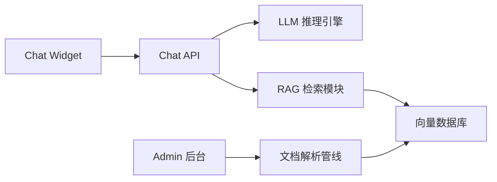
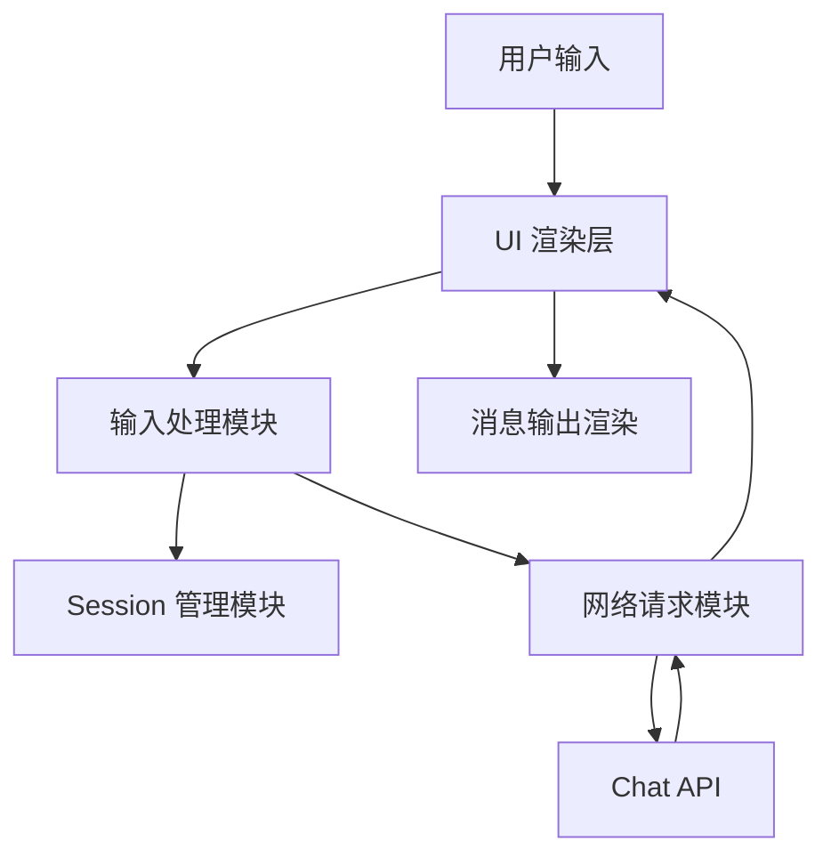
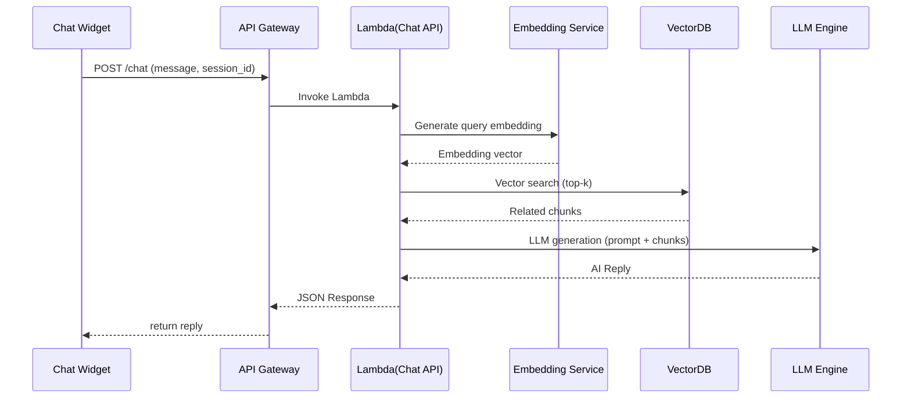

# 详细组件设计文档（Component Detailed Design Document）

**Document Version:** 1.0
**Status:** Draft
**Author:** Andy
**Project Name:** AstraChat — AWS Serverless AI Customer Service Demo

本详细组件设计文档（LLD, Low-Level Design）用于描述 AstraChat 系统中各核心组件的内部结构、处理流程、接口定义与技术细节。本文件为开发阶段的直接实施依据，需确保内容具体、可执行、可验证。

## 1 引言（Introduction）

### 1.1 文档目的（Purpose）

- 明确各组件的内部结构与职责
- 描述具体的数据流、控制流与模块边界
- 指导开发人员实现一致、可维护的代码
- 为后续测试、代码审查、文档维护提供依据

### 1.2 文档范围（Scope）

本文件覆盖以下 AstraChat 组件的低层设计：

- Chat Widget（前端）
- Chat API
- LLM 推理引擎
- RAG 检索模块
- 向量数据库（VectorDB）模块
- 文档解析管线（Document Pipeline）
- Admin 文档上传与管理后台

## 2 系统组件概览（Component Overview）

### 2.1 组件列表

| 组件名称           | 描述                                      |
| ------------------ | ----------------------------------------- |
| Chat Widget        | 前端聊天 UI，负责发送消息与展示 AI 回复   |
| Chat API           | 后端入口，协调 RAG 与 LLM 流程            |
| LLM 推理引擎       | 负责生成自然语言回复的模型接口层          |
| RAG 检索模块       | 进行向量检索并返回相关文档片段            |
| VectorDB           | 存储文档向量，用于语义检索                |
| 文档解析管线       | 管理员上传文档后的解析 → 切片 → Embedding |
| Admin 文档管理后台 | 提供文件上传与知识库管理 UI               |

### 2.2 组件依赖关系图



## 3 组件详细设计（Detailed Component Design）

### 3.1 Chat Widget（前端聊天控件）

Chat Widget 是 AstraChat 面向最终用户的交互入口，负责捕获用户输入、展示 AI 回复，并维护前端的会话状态。

#### 3.1.1 组件职责（Responsibilities）

- 提供可嵌入任意网页的轻量级聊天窗口（iframe / script embed）。
- 发送用户输入到后端 Chat API。
- 展示 AI 回复、加载中状态与错误提示。
- 管理 session_id，实现多轮对话关联。
- 封装网络请求，处理超时、重试与异常。

#### 3.1.2 内部结构（Internal Structure）

| 子模块          | 功能说明                                       |
| --------------- | ---------------------------------------------- |
| UI Renderer     | 渲染聊天窗口、气泡、头像、时间戳等界面元素     |
| Input Handler   | 监听输入框事件（回车/发送按钮）                |
| Session Manager | 自动生成并维护 session_id（localStorage 保存） |
| Network Client  | 调用 Chat API，内含超时、重试逻辑              |
| State Manager   | 管理加载状态、错误状态、消息历史               |

#### 3.1.3 Chat Widget 架构图



#### 3.1.4 输入 / 输出（I/O Specification）

**输入（Input）**：

- 用户输入文本 message
- 自动维护的 session_id

**输出（Output）**：

- AI 回复文本
- 错误提示（网络错误、服务端错误）

#### 3.1.5 错误处理（Error Handling）

| 场景            | 处理方式                       |
| --------------- | ------------------------------ |
| 网络请求超时    | 显示错误提示，可“重试发送”     |
| API 返回错误    | 展示错误气泡，不展示内部错误码 |
| session_id 丢失 | 自动重新生成并重新发送请求     |

#### 3.1.6 性能与限制（Performance Constraints）

- UI 渲染需在 16ms 内完成（保证流畅动画）。
- 单条消息长度 ≤ 2,048 字符。
- Chat Widget 包体积建议 ≤ 200KB（压缩后）。

#### 3.1.7 安全性要求（Security Considerations）

- 不在前端存储任何 API Key。
- 所有请求必须通过 HTTPS。
- 浏览器缓存的数据（session_id）不包含敏感信息。

### 3.2 Chat API（API Gateway + Lambda）

Chat API 是 AstraChat 系统的后端核心入口，负责接收前端消息、协调 RAG 与 LLM 推理流程，并返回最终响应。该组件通过 AWS API Gateway 提供外部 HTTPS 接口，由 AWS Lambda 执行实际逻辑。

#### 3.2.1 组件职责（Responsibilities）

- 对外暴露统一的 `/chat` API（HTTPS）。
- 接收 Chat Widget 发来的消息与 session_id。
- 调用 Embedding 服务处理 query。
- 执行 RAG 检索（语义向量搜索）。
- 调用 LLM 推理引擎生成回答。
- 将对话历史写入 DynamoDB。
- 返回最终回答给前端。

#### 3.2.2 内部结构（Internal Structure）

| 子模块            | 功能说明                                        |
| ----------------- | ----------------------------------------------- |
| Request Validator | 参数校验（长度、格式、非法字符过滤）            |
| Session Manager   | 负责读取 / 更新 session 历史                    |
| Embedding Client  | 调用向量化 API 生成 query embedding             |
| Retriever         | 从 VectorDB 检索 top-k 相关向量                 |
| LLM Client        | 调用大模型（Bedrock / OpenAI / Claude）生成回复 |
| Response Builder  | 整理上下文并构造返回 JSON                       |
| Logger & Metrics  | CloudWatch 日志、耗时监控、失败率统计           |

#### 3.2.3 时序图（Sequence Diagram）



#### 3.2.4 输入 / 输出（I/O Specification）

输入（Input JSON）

```json
{
"session_id": "string (<=64)",
"message": "string (<=2048)",
"language": "auto | en | zh"
}
```

输出（Output JSON）

```json
{
"reply": "string",
"session_id": "string",
"sources": [
{ "chunk_id": "id", "score": 0.88 }
]
}
```

#### 3.2.5 错误处理（Error Handling）

| 错误场景             | 处理方式                 |
| -------------------- | ------------------------ |
| 参数缺失 / 非法      | 返回 400 + 提示信息      |
| 超过速率限制         | 返回 429 + 重试等待时间  |
| LLM 服务失败         | 返回兜底回答（fallback） |
| VectorDB 超时        | 降级为纯 LLM 的回复      |
| Embedding 服务不可用 | 直接使用纯 LLM 回复      |

#### 3.2.6 性能参数与配置（Performance Constraints）

- **Lambda Memory：** 1024 MB（加速冷启动）
- **Timeout：** 10 秒
- **API Gateway 超时：** 29 秒
- **最大 QPS（初始）：** 30 req/s（可横向扩展）
- **重试策略：** 3 次指数退避（Embedding / VectorDB）

#### 3.2.7 安全性要求（Security Considerations）

- API 采用 IAM + API Key 或 JWT 保护（可选）
- 禁止在 URL 中透传敏感信息
- 日志中屏蔽用户隐私字段
- API Gateway 强制 HTTPS
- CORS 限制仅允许绑定域名