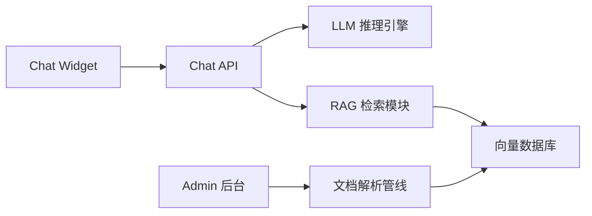
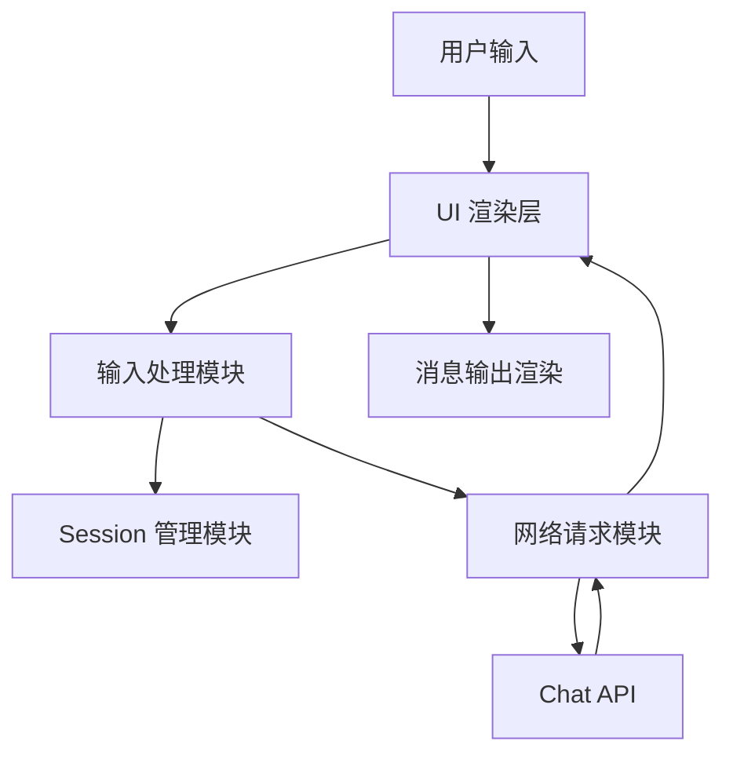
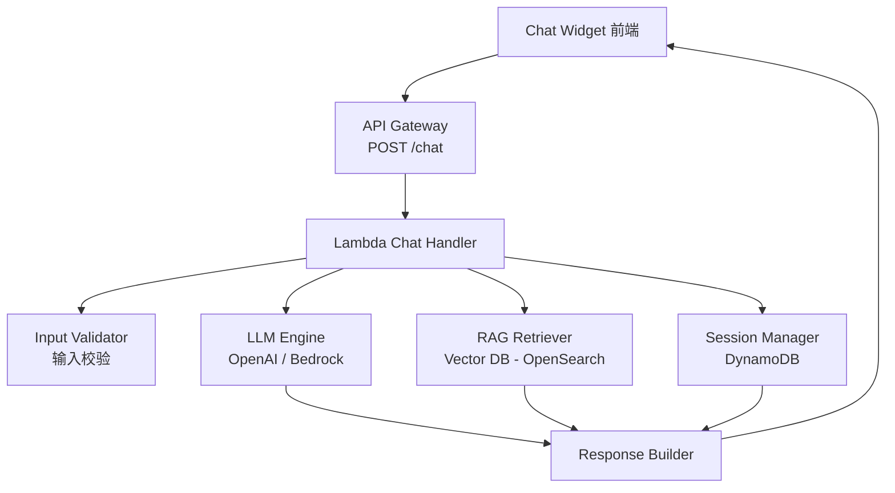
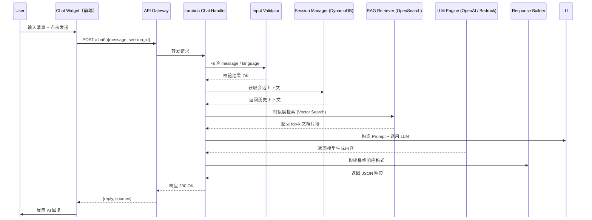

# 详细组件设计文档（Component Detailed Design Document）

**Document Version:** 1.0
**Status:** Draft
**Author:** Andy
**Project Name:** AstraChat — AWS Serverless AI Customer Service Demo

本详细组件设计文档（LLD, Low-Level Design）用于描述 AstraChat 系统中各核心组件的内部结构、处理流程、接口定义与技术细节。本文件为开发阶段的直接实施依据，需确保内容具体、可执行、可验证。

## 1 引言（Introduction）

### 1.1 文档目的（Purpose）

- 明确各组件的内部结构与职责
- 描述具体的数据流、控制流与模块边界
- 指导开发人员实现一致、可维护的代码
- 为后续测试、代码审查、文档维护提供依据

### 1.2 文档范围（Scope）

本文件覆盖以下 AstraChat 组件的低层设计：

- Chat Widget（前端）
- Chat API
- LLM 推理引擎
- RAG 检索模块
- 向量数据库（VectorDB）模块
- 文档解析管线（Document Pipeline）
- Admin 文档上传与管理后台

## 2 系统组件概览（Component Overview）

### 2.1 组件列表

| 组件名称           | 描述                                      |
| ------------------ | ----------------------------------------- |
| Chat Widget        | 前端聊天 UI，负责发送消息与展示 AI 回复   |
| Chat API           | 后端入口，协调 RAG 与 LLM 流程            |
| LLM 推理引擎       | 负责生成自然语言回复的模型接口层          |
| RAG 检索模块       | 进行向量检索并返回相关文档片段            |
| VectorDB           | 存储文档向量，用于语义检索                |
| 文档解析管线       | 管理员上传文档后的解析 → 切片 → Embedding |
| Admin 文档管理后台 | 提供文件上传与知识库管理 UI               |

### 2.2 组件依赖关系图



## 3 组件详细设计（Detailed Component Design）

### 3.1 Chat Widget（前端聊天控件）

Chat Widget 是 AstraChat 面向最终用户的交互入口，负责捕获用户输入、展示 AI 回复，并维护前端的会话状态。

#### 3.1.1 组件职责（Responsibilities）

- 提供可嵌入任意网页的轻量级聊天窗口（iframe / script embed）。
- 发送用户输入到后端 Chat API。
- 展示 AI 回复、加载中状态与错误提示。
- 管理 session_id，实现多轮对话关联。
- 封装网络请求，处理超时、重试与异常。

#### 3.1.2 内部结构（Internal Structure）

| 子模块          | 功能说明                                       |
| --------------- | ---------------------------------------------- |
| UI Renderer     | 渲染聊天窗口、气泡、头像、时间戳等界面元素     |
| Input Handler   | 监听输入框事件（回车/发送按钮）                |
| Session Manager | 自动生成并维护 session_id（localStorage 保存） |
| Network Client  | 调用 Chat API，内含超时、重试逻辑              |
| State Manager   | 管理加载状态、错误状态、消息历史               |

#### 3.1.3 Chat Widget 架构图



#### 3.1.4 输入 / 输出（I/O Specification）

**输入（Input）**：

- 用户输入文本 message
- 自动维护的 session_id

**输出（Output）**：

- AI 回复文本
- 错误提示（网络错误、服务端错误）

#### 3.1.5 错误处理（Error Handling）

| 场景            | 处理方式                       |
| --------------- | ------------------------------ |
| 网络请求超时    | 显示错误提示，可“重试发送”     |
| API 返回错误    | 展示错误气泡，不展示内部错误码 |
| session_id 丢失 | 自动重新生成并重新发送请求     |

#### 3.1.6 性能与限制（Performance Constraints）

- UI 渲染需在 16ms 内完成（保证流畅动画）。
- 单条消息长度 ≤ 2,048 字符。
- Chat Widget 包体积建议 ≤ 200KB（压缩后）。

#### 3.1.7 安全性要求（Security Considerations）

- 不在前端存储任何 API Key。
- 所有请求必须通过 HTTPS。
- 浏览器缓存的数据（session_id）不包含敏感信息。

### **3.2 Chat API（API Gateway + Lambda）**

#### **3.2.1 组件职责（Responsibilities）**

Chat API 是 AstraChat 系统的 **核心后端接口**，承担：

1. **接收前端消息（Chat Widget → API Gateway）**
2. **调用会话管理逻辑（Session Management）**
3. **触发 LLM 推理（通过 AWS Lambda 内部业务模块）**
4. **触发 RAG 检索流程（调用 VectorDB / OpenSearch）**
5. **返回统一的 JSON 回复格式**
6. **记录日志与审计信息**
7. **错误统一包装（Error Wrapper）**

**Chat API 是前端与 AI 引擎之间的桥梁，负责安全、稳定、可扩展地传递消息。**

#### **3.2.2 内部结构（Internal Structure）**

Chat API（Lambda 内部）分为 5 个功能子模块：

**(1) Input Validator — 输入校验器**

- 校验字段：session_id / message / language
- 防止异常输入、XSS、过长字符串

**(2) Session Manager — 会话管理器**

- 新 session 自动创建
- 从 DynamoDB 读取历史对话
- 多轮对话上下文拼接

**(3) RAG Retriever — 检索模块（可选）**

- 是否命中文档内容
- top-K（默认 3～5）检索
- 返回相关 chunk

**(4) LLM Engine — 推理引擎**

- 调用 OpenAI API / Bedrock API
- 负责生成自然语言回复
- 支持温度、最大 token 等参数

**(5) Response Builder — 响应构造器**

- 格式化 Chat API 的输出结构
- 数据字段统一包装
- 添加 usage（token 用量）数据

#### **3.2.3 Chat API 架构图**



#### **3.2.4 输入 / 输出规范（I/O Specification）**

**Chat API Input（前端 → 后端）**

| 字段       | 类型   | 必填 | 约束        | 说明                   |
| ---------- | ------ | ---- | ----------- | ---------------------- |
| session_id | string | Yes  | 长度 ≤ 64   | 前端会话标识（上下文） |
| message    | string | Yes  | 长度 ≤ 2048 | 用户输入的文本消息     |
| language   | string | No   | auto/en/zh  | 系统自动识别或手动指定 |

**示例请求：**

```json
{
  "session_id": "abc123",
  "message": "你们提供哪些产品？",
  "language": "auto"
}
```

**Chat API Output（后端 → 前端）**

| 字段       | 类型   | 说明                               |
| ---------- | ------ | ---------------------------------- |
| reply      | string | AI 最终返回文本                    |
| sources    | array  | RAG 检索到的文档片段（可为空）     |
| usage      | object | token 使用统计（提示词/回复/总计） |
| session_id | string | 与输入一致                         |

**示例输出：**

```json
{
  "reply": "我们提供 A、B、C 三类产品…",
  "sources": [
    {
      "doc_id": "p1",
      "chunk": "产品目录..."
    }
  ],
  "usage": {
    "prompt_tokens": 180,
    "completion_tokens": 95,
    "total_tokens": 275
  },
  "session_id": "abc123"
}
```

#### 3.2.4 时序图（Sequence Diagram）




#### **3.2.5 错误处理（Error Handling）**

统一错误格式如下：

```json
{
  "error": {
    "code": "INVALID_INPUT",
    "message": "message 字段不能为空"
  }
}
```

常见错误类型：

| 错误码        | 触发场景                  |
| ------------- | ------------------------- |
| INVALID_INPUT | message/session_id 为空   |
| UNAUTHORIZED  | 未携带 API Key 或签名不符 |
| LLM_ERROR     | LLM API 调用失败          |
| RAG_ERROR     | 检索服务不可用            |
| SERVER_ERROR  | Lambda 内部异常           |

#### **3.2.6 性能与限制（Performance Constraints）**

AWS 限制下建议：

- 单次 Lambda 时长 ≤ 3 秒
- 最大并发 ≥ 50（自动扩容）
- RAG 检索 ≤ 200ms
- LLM 回复 ≤ 2 秒
- 输入消息长度 ≤ 2048 字符
- 返回结果大小 ≤ 100 KB

#### **3.2.7 安全性要求（Security Considerations）**

API 层安全

- 必须启用 **API Key**
- 必须启用 **Rate Limit （节流）**
- 必须启用 **CORS 白名单**

Lambda 内部安全

- 所有访问 DynamoDB / VectorDB 的 IAM 权限都必须是 **最小权限原则**
- 所有日志中隐藏敏感内容（如用户隐私信息）

数据安全

- 对话存储加密（DynamoDB SSE）
- 向量存储加密（OpenSearch Encryption）
- 网络通信使用 HTTPS（API Gateway 默认支持）