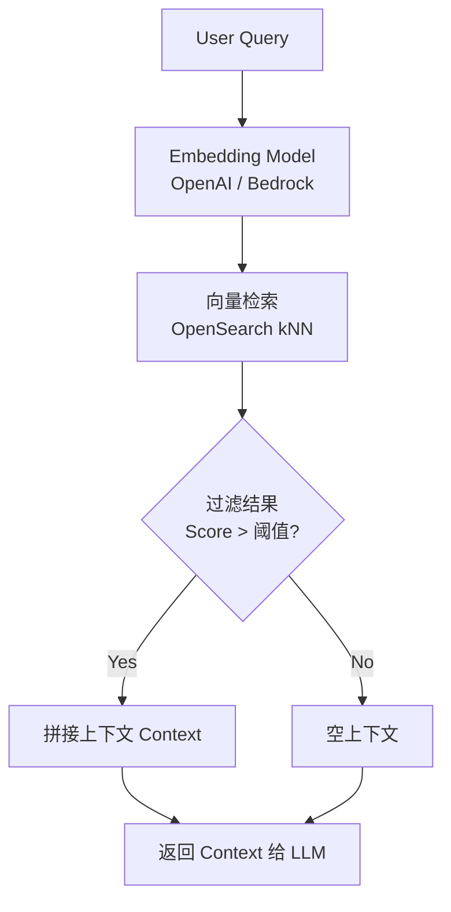
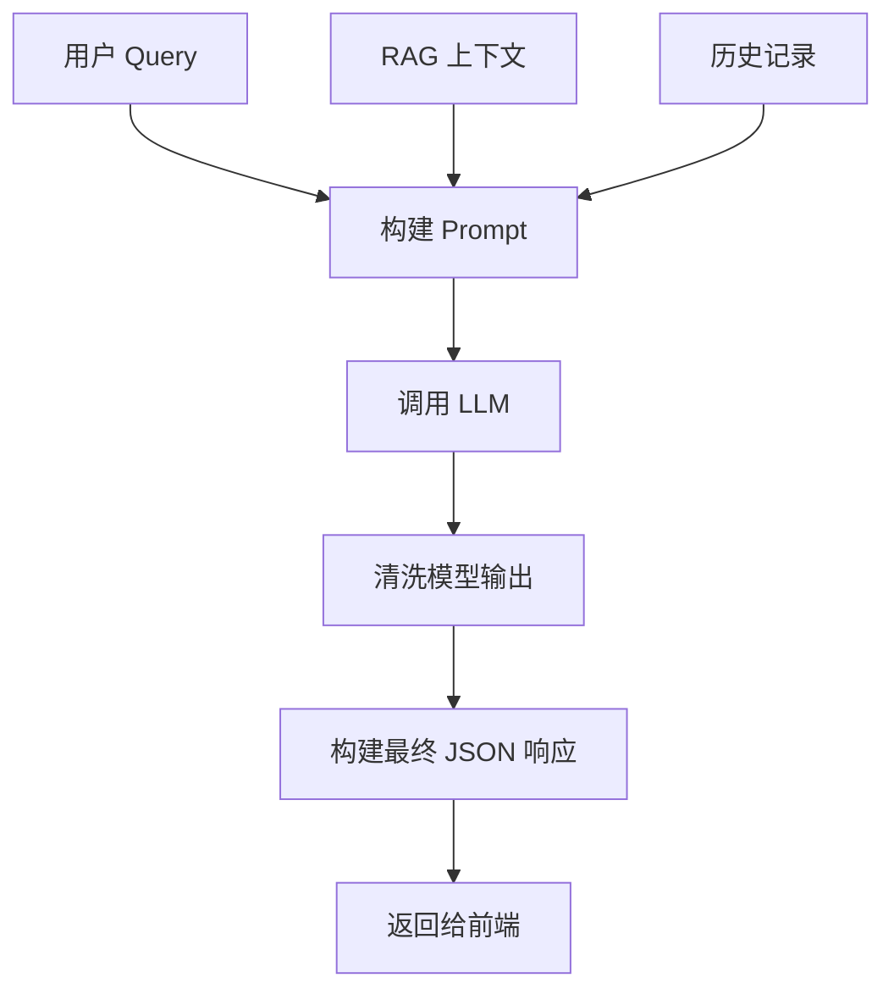

# 代码详细设计文档（Source Code Detailed Design Document）

**Document Version:** 1.0
**Status:** Draft
**Author:** Andy
**Project Name:** AstraChat — AWS Serverless AI Customer Service Demo

## 1 引言（Introduction）

本文件为 AstraChat 项目对应的 **代码级详细设计文档**（Code-Level Design），用于从源码结构维度进一步描述：

- 目录结构设计（Project Folder Structure）
- 文件划分方案（File Responsibility）
- 函数级接口设计（Function-Level Design）
- 公共库与工具封装（Common Utilities）
- 部署与运行方式（Lambda Packaging / Web Build）
- 与组件设计文档（LLD）的对应关系

本设计将严格对应：

- **3.1 Chat Widget**
- **3.2 Chat API**

并为后续实现提供统一的代码蓝图。

## 2 项目整体代码结构（Project Source Structure）

以下展示项目的整体代码结构草案，后续章节中会逐一详细展开。

```txt
AstraChat/
│
├── frontend/                         # 前端代码（Chat Widget + 示例页面）
│   └── chat_widget/
│       ├── index.html                # 测试页面（本地调试专用）
│       ├── index.js                  # 主入口：加载 UI 并绑定事件
│       ├── widget.css                # 样式
│       ├── api_client.js             # 调用 AWS API Gateway 的封装
│       ├── session.js                # sessionId、本地会话管理
│       └── components/               # UI 组件
│           ├── MessageBubble.js
│           └── LoadingIndicator.js
│
├── backend/                          # 后端代码（Node.js Lambda + API）
│   └── chat_api/                     # 3.2 Chat API Lambda
│       ├── handler.js                # Lambda 主入口
│       ├── validator.js              # 输入校验
│       ├── rag_client.js             # 检索增强（RAG）逻辑
│       ├── llm_client.js             # 大模型调用（OpenAI / AWS Bedrock）
│       ├── session_manager.js        # Session 处理（DynamoDB）
│       ├── response_builder.js       # 响应格式构造
│       ├── config.js                 # 配置项（API Key、表名等）
│       ├── utils/
│       │   ├── http.js               # HTTP 处理工具
│       │   ├── logger.js             # CloudWatch 日志包装
│       │   └── retry.js              # 简单重试器（LLM/RAG 调用）
│       └── errors/
│           └── error_handler.js      # 统一错误处理
│
├── common/                           # 公共工具模块（Node.js）
│   ├── aws_clients.js                # DynamoDB、OpenSearch、S3 客户端
│   ├── prompt_builder.js             # Prompt 模板生成
│   ├── constants.js                  # 常量定义
│   └── utils.js                      # 公共工具函数
│
├── infrastructure/                   # IaC—AWS 部署（CDK 或 Terraform）
│   ├── cdk.json
│   ├── app.js                        # CDK 入口文件
│   └── stacks/
│       └── api_stack.js              # API Gateway + Lambda + DynamoDB + 权限
│
└── README.md                         # 项目说明文档
```

## 3 Chat Widget 代码设计（Frontend Code Design）

Chat Widget 是 AstraChat 的前端核心交互组件。本章将详细说明其代码结构、文件设计、类与函数接口、状态管理方案及与后端 API 的联动方式。

### 3.1 目录结构（Folder Structure）

```txt
frontend/chat_widget/
│
├── index.js # 入口文件，挂载 Widget
├── widget.css # 样式文件
├── api_client.js # 与 Chat API 通信
├── session.js # session_id 管理
├── state.js # 状态管理（loading/error）
└── components/
├── MessageBubble.js # 消息气泡组件
└── LoadingIndicator.js# 加载组件
```

**目录结构说明**

| 文件                           | 职责                                              |
| ------------------------------ | ------------------------------------------------- |
| index.js                       | 初始化 widget、绑定 DOM、加载样式、集成所有子模块 |
| api_client.js                  | 实现 fetch 调用、超时、重试、错误处理             |
| session.js                     | 统一管理 session_id（localStorage）               |
| state.js                       | 管理 UI 状态（loading / error / history）         |
| components/MessageBubble.js    | 气泡 UI                                           |
| components/LoadingIndicator.js | 加载 UI                                           |

### 3.2 index.js 设计（入口文件）

**职责**

- 创建聊天窗口 HTML 结构
- 初始化事件监听（输入框、发送按钮）
- 整合 session、api_client、组件
- 渲染消息列表

**代码骨架**

```c
import { sendMessageToAPI } from "./api_client.js";
import { getSessionId } from "./session.js";
import { renderMessage, renderLoading } from "./components/MessageBubble.js";


class ChatWidget {
constructor(config) {
this.apiUrl = config.apiUrl;
this.sessionId = getSessionId();
this.container = null;
}


mount(selector) {
this.container = document.querySelector(selector);
this.container.innerHTML = this._buildUI();
this._bindEvents();
}


async _onSend() {
const input = this.container.querySelector("#chat-input");
const text = input.value;
if (!text) return;


renderMessage(text, "user");
renderLoading();


const reply = await sendMessageToAPI(this.apiUrl, this.sessionId, text);
renderMessage(reply, "assistant");
}


_bindEvents() {
const btn = this.container.querySelector("#chat-send");
btn.addEventListener("click", () => this._onSend());
}


_buildUI() {
return `
<div class="astra-chatbox">
<div id="messages"></div>
<div class="chat-input-row">
<input id="chat-input" placeholder="Type a message..." />
<button id="chat-send">Send</button>
</div>
</div>`;
}
}


export default ChatWidget;
```

### 3.3 api_client.js 设计（网络请求模块）

**功能**

- 调用后端 Chat API
- 自动带上 session_id
- 管理重试、超时

**代码骨架**

```java
export async function sendMessageToAPI(apiUrl, sessionId, message) {
try {
const controller = new AbortController();
const timeout = setTimeout(() => controller.abort(), 10000);


const res = await fetch(apiUrl, {
method: "POST",
headers: { "Content-Type": "application/json" },
body: JSON.stringify({ session_id: sessionId, message }),
signal: controller.signal
});


clearTimeout(timeout);


if (!res.ok) {
throw new Error(`HTTP Error ${res.status}`);
}


const data = await res.json();
return data.reply;
} catch (err) {
return "抱歉，服务器暂时不可用，请稍后再试。";
}
}
```

### 3.4 session.js（Session 管理）

```java
export function getSessionId() {
let id = localStorage.getItem("astra_session");
if (!id) {
id = crypto.randomUUID();
localStorage.setItem("astra_session", id);
}
return id;
}
```

### 3.5 UI 组件设计（MessageBubble、LoadingIndicator）

**MessageBubble.js**

```java
export function renderMessage(text, role) {
const msgBox = document.querySelector("#messages");
const el = document.createElement("div");
el.className = `msg msg-${role}`;
el.innerText = text;
msgBox.appendChild(el);
}
```

**LoadingIndicator.js**

```java
export function renderLoading() {
const msgBox = document.querySelector("#messages");
const el = document.createElement("div");
el.className = "loading";
el.innerText = "…";
msgBox.appendChild(el);
}
```

## 4 Chat API（API Gateway + Lambda）详细设计

### 4.1 目录结构

 ```txt
 /backend
  ├── chat_handler/
  │    ├── handler.js                 # Lambda 主入口
  │    ├── validator.js               # 输入校验模块
  │    ├── session_manager.js         # 会话管理（DynamoDB）
  │    ├── rag_retriever.js           # RAG 检索
  │    ├── llm_engine.js              # LLM 调用封装
  │    ├── response_builder.js        # 输出构造器
  │    ├── config.js                  # 配置（模型参数等）
  │    └── utils.js                   # 工具函数
  └── package.json
 ```

### 4.2  Lambda 主流程设计（handler.js）

#### 4.2.1 handler.js 模块职责

- 作为 Lambda 的入口
- 解析 API Gateway event
- 调用所有子模块
- 捕获异常并返回统一错误格式

#### 4.2.2 handler.js 输入/输出定义

**输入（来自 API Gateway event）**

```json
{
  "session_id": "abc123",
  "message": "你好，请问你们的产品是什么？",
  "language": "auto"
}
```

**输出**

```json
{
  "reply": "...",
  "sources": [...],
  "usage": {...},
  "session_id": "abc123"
}
```

#### 4.2.3 handler.js 伪代码（Pseudo-code）

```json
async function handler(event) {
  const body = JSON.parse(event.body);

  // 1. 校验输入
  validator.validate(body);

  // 2. 会话上下文
  const history = await sessionManager.load(body.session_id);

  // 3. RAG 检索
  const ragChunks = await ragRetriever.search(body.message);

  // 4. 构造 prompt
  const prompt = buildPrompt(history, ragChunks, body.message);

  // 5. LLM 调用
  const { reply, usage } = await llmEngine.generate(prompt);

  // 6. 构造输出
  const result = responseBuilder.build(reply, ragChunks, usage, body.session_id);

  // 7. 保存对话
  await sessionManager.save(body.session_id, body.message, reply);

  return success(result);
}

```

### 4.3 RAG Client（检索增强模块）设计

​	本章节说明 **rag_client.js** 的整体职责、流程、输入输出、错误处理以及可直接在 AWS Lambda 中运行的代码骨架。

​	RAG（Retrieval-Augmented Generation）模块用于在 LLM 回复之前，从向量数据库（OpenSearch / Elastic / Pinecone / FAISS / Milvus 等）中检索相关内容，并作为上下文提供给大语言模型，增强系统回答的准确性。

#### 4.3.1 组件职责（Responsibilities）

rag_client.js 负责：

1. **文本嵌入生成（Embedding）**
    调用 OpenAI embeddings（或 AWS Bedrock Titan Embeddings）。
2. **向量检索**
    通过 OpenSearch 的 kNN API（或其他向量库）查找最相似内容。
3. **结果过滤与排序**
    按相似度阈值进行筛选，避免无关内容进入模型。
4. **构建“上下文片段（Context Chunks）”**
    把检索到的文本片段拼接成 prompt 可读的格式。
5. **返回可直接提供给 LLM 的 context 文本**。

#### 4.3.2 内部结构（Internal Structure）

rag_client.js 内部通常包含以下函数：

| 函数名                                    | 职责                             |
| ----------------------------------------- | -------------------------------- |
| **getEmbedding(text)**                    | 调用 OpenAI/AWS Bedrock 生成向量 |
| **searchSimilarVectors(embedding, topK)** | 查询向量数据库                   |
| **filterByScore(results)**                | 按 similarity_score 筛选         |
| **formatContext(results)**                | 将多个检索结果拼接为上下文       |
| **retrieveContext(query)**                | 主流程：综合上述步骤             |

目录结构一般如下：

```
backend/chat_api/
 ├── rag_client.js
 ├── llm_client.js
 ├── ...
common/
 ├── aws_clients.js
 ├── ...
```

#### 4.3.3 输入 / 输出（I/O Specification）

**输入（Input）**

```json
{
  "query": "用户的当前提问内容",
  "topK": 5
}
```

**输出（Output）**

```json
{
  "context": "拼接后的上下文文本",
  "rawChunks": [
    {
      "text": "...",
      "score": 0.88,
      "source": "docs/xxx.md"
    }
  ]
}
```

#### 4.3.4 错误处理（Error Handling）

本模块必须处理：

| 错误类型                   | 处理方式                         |
| -------------------------- | -------------------------------- |
| OpenAI embeddings API 失败 | 重试 3 次 → 失败则返回空 context |
| OpenSearch 查询失败        | 写日志 → 返回空数组              |
| 查询结果为空               | 返回空 context，不阻塞对话流程   |

所有异常统一抛给 error_handler.js 处理。

#### 4.3.5 **性能与限制（Performance Constraints）**

- Embedding API 会消耗 Token → 必须缓存结果（TODO）。
- OpenSearch kNN 检索延迟通常 20~80ms。
- topK 不建议大于 10（prompt 变长会让 LLM 成本升高）。
- 每次检索 ≤ 1000 字符文本，不要直接发送大文档。

#### 4.3.6 **安全性要求（Security Considerations）**

- 只能调用内部定义的 AWS OpenSearch 域名
- 严禁将 query 写入日志（隐私信息）
- 不记录用户原始输入，只记录 vector id 与 similarity score

#### 4.3.7 关键流程图



#### 4.3.8 rag_client.js —— 完整代码骨架

```json
// backend/chat_api/rag_client.js

import { getEmbedding } from "../common/aws_clients.js";
import { opensearchClient } from "../common/aws_clients.js";
import { logger } from "./utils/logger.js";

const INDEX_NAME = "astra-chat-vectors";
const SCORE_THRESHOLD = 0.75;
const TOP_K_DEFAULT = 5;

// 1. 获取 Embedding
export async function embedText(text) {
    try {
        const vector = await getEmbedding(text);
        return vector; // [dim]
    } catch (err) {
        logger.error("Embedding 失败", err);
        throw err;
    }
}

// 2. 向量检索
export async function searchSimilarVectors(embedding, topK = TOP_K_DEFAULT) {
    try {
        const body = {
            size: topK,
            query: {
                knn: {
                    embedding: {
                        vector: embedding,
                        k: topK
                    }
                }
            }
        };

        const response = await opensearchClient.search({
            index: INDEX_NAME,
            body
        });

        return response.hits.hits.map(hit => ({
            text: hit._source.text,
            score: hit._score,
            source: hit._source.source
        }));
    } catch (err) {
        logger.error("OpenSearch 查询失败", err);
        return [];
    }
}

// 3. 筛选
export function filterByScore(chunks) {
    return chunks.filter(c => c.score >= SCORE_THRESHOLD);
}

// 4. 格式化 context
export function formatContext(chunks) {
    if (chunks.length === 0) return "";

    return chunks
        .map(c => `【来源：${c.source}】\n${c.text}`)
        .join("\n\n---\n\n");
}

// 5. 主流程：RAG 检索
export async function retrieveContext(query, topK = TOP_K_DEFAULT) {
    logger.info("RAG 开始检索");

    try {
        const embedding = await embedText(query);
        const results = await searchSimilarVectors(embedding, topK);
        const filtered = filterByScore(results);
        const ctx = formatContext(filtered);

        return {
            context: ctx,
            rawChunks: filtered
        };
    } catch (err) {
        logger.error("RAG 检索异常", err);
        return {
            context: "",
            rawChunks: []
        };
    }
}
```

### 4.4 Response Builder（响应构造器）详细设计

#### 4.4.1 组件职责（Responsibilities）

response_builder.js 负责：

**1. 构造发送给 LLM 的最终 Prompt**

包括：

- 系统提示（System Prompt）
- 用户输入（User Query）
- RAG 上下文（Context）
- 历史会话（History）
- 模型参数（Temperature、Max Tokens）

**2. 清洗 LLM 的输出**

如：

- 去除思考链（chain-of-thought）
- 去除敏感标记（<thinking> 等）
- 去除模型自说自话的内容

**3. 返回前端可用的数据格式**

最终格式：

```json
{
  "assistant_message": "这是模型最终回复",
  "context_used": "...",
  "tokens": {
    "input": 123,
    "output": 456
  }
}
```

#### 4.4.2 内部结构（Internal Structure）

response_builder.js 内部通常包含：

| 函数名                                         | 职责              |
| ---------------------------------------------- | ----------------- |
| buildPrompt(context, history, query)           | 构造 LLM Prompt   |
| cleanLLMResponse(rawText)                      | 清洗模型输出      |
| formatFinalResponse(rawText, context, tokens)  | 构造最终返回 JSON |
| buildResponse(context, history, query, tokens) | 对外暴露的主流程  |

目录结构：

```
backend/chat_api/
 ├── response_builder.js
```

#### 4.4.3 **输入 / 输出定义（I/O Specification）**

**输入（来自 handler.js）**

```json
{
  "query": "你好，请问你是谁？",
  "context": "...",
  "history": [
    { "role": "user", "content": "上一轮的提问" },
    { "role": "assistant", "content": "上一轮的回答" }
  ],
  "llm_output": "LLM原始输出内容…",
  "tokens": {
    "input": 120,
    "output": 210
  }
}
```

**输出**

```json
{
  "assistant_message": "你好，我是 AstraChat 智能助手。",
  "context_used": "...(RAG 内容)...",
  "tokens": { "input": 120, "output": 210 }
}
```

#### 4.4.4 **错误处理（Error Handling）**

- 如果 history 为空 → 不使用历史
- 如果 context 为空 → 正常回答，但不加知识库内容
- 如果 LLM 输出为空 → 返回预设错误文案
- 所有处理错误统一交给 error_handler.js 打日志

#### 4.4.5 **性能约束（Performance Constraints）**

- 一个最终 prompt 长度不能超过模型 max_token 的 1/3
- 上下文拼接文本必须限制长度（建议 1000 字以内）
- 历史会话不超过 5 条（否则浪费 token 成本）

#### 4.4.6 Response Builder 逻辑流程



#### 4.4.7  **函数伪代码（JavaScript 风格）**

**1 cleanLLMResponse()**

```json
function cleanLLMResponse(rawText):
    if rawText is empty:
        return "对不起，我暂时无法回答。"

    let text = rawText

    // 移除 <thinking> 标签和其中内容
    text = remove("<thinking> ... </thinking>")

    // 移除 HTML 标签
    text = remove("<.*?>")

    return trim(text)
```

**2 buildPrompt(context, history, query)**

```json
function buildPrompt(context, history, query):
    let prompt = systemPrompt

    if context exists:
        prompt += "【相关知识】" + context

    if history exists:
        prompt += "【历史对话】" + formatHistory(history)

    prompt += "【用户问题】" + query

    return prompt
```

**3 formatFinalResponse()**

```json
function formatFinalResponse(cleaned, context, tokens):
    return {
        assistant_message: cleaned,
        context_used: context,
        tokens: tokens
    }
```

**4 buildResponse() —— 主流程**

```json
function buildResponse({ query, context, history, llm_output, tokens }):
    cleaned = cleanLLMResponse(llm_output)
    return formatFinalResponse(cleaned, context, tokens)
```

#### 4.4.8  **特殊行为说明**

| 场景                      | 处理方式                                  |
| ------------------------- | ----------------------------------------- |
| 模型输出包含 `<thinking>` | 自动删除，避免思维链泄露                  |
| RAG 结果为空              | 仍正常回答，但 context_used = ""          |
| 模型输出有 HTML           | 去除标签                                  |
| 多行空格、换行            | 自动压缩                                  |
| 异常情况                  | 返回固定可控文案 `"系统繁忙，请稍后再试"` |

#### 4.4.9 **与 Lambda Handler 的关系**

```
handler.js
    ↓（调用）
response_builder.buildResponse()
```

本模块依赖：

```
logger.js（日志）
llm_client.js（提供 llm_output、tokens）
rag_client.js（提供 context）
```