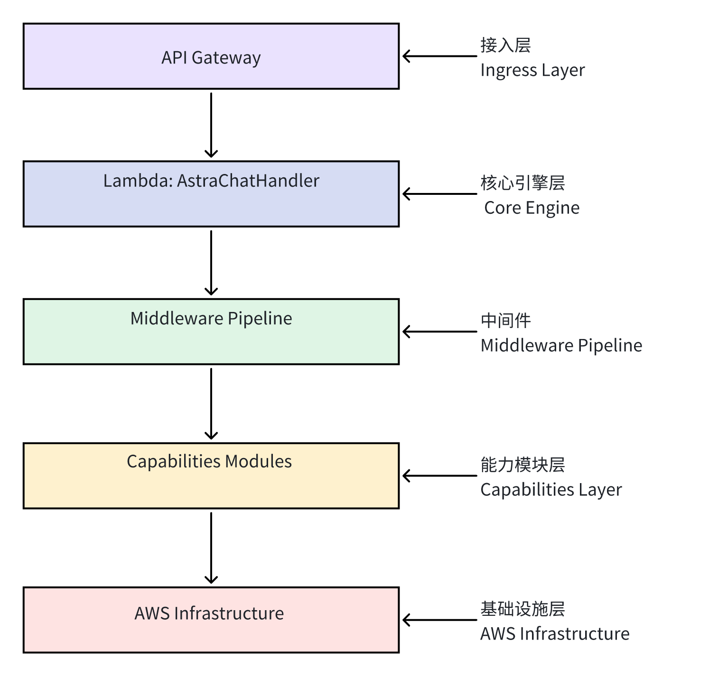
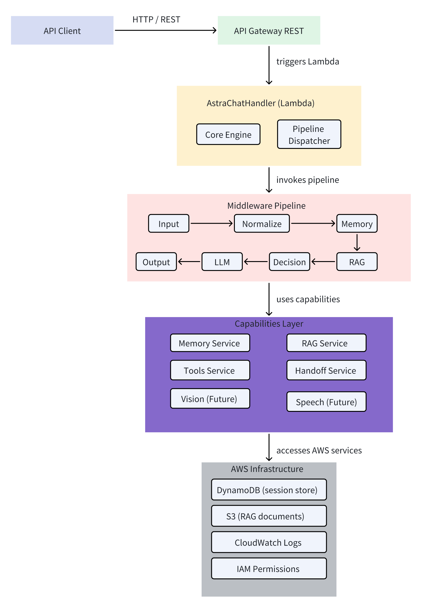

# 1. 引言（Introduction）

本《系统架构设计说明书》（System Architecture Design Document, SAD）用于定义 AstraChat 系统的总体架构设计，包括：

- 系统分层结构  
- 模块职责划分  
- 数据流设计  
- 中间件 Pipeline 设计  
- Provider 统一封装设计  
- 工具调用与 RAG 机制  
- 可扩展性与未来增强能力预留  

本架构文档是基于《需求规格说明书》（SRS）生成的技术实现蓝图，用于指导后续的：

- 功能详细设计  
- 代码实现  
- 部署策略  
- 测试规划  

目标：

- 构建一个可扩展、可维护、可部署到 AWS Serverless 的 AI 中间件  
- 使用 ADAS 信号链式模块化架构，实现高可扩展性与低耦合  
- 支持多模态、RAG、工具调用与人工客服转接  

读者包括：

- 系统架构师  
- 后端开发人员  
- 测试人员  
- DevOps  
- 技术评审人员  

# 2. 架构概述（Architecture Overview）

AstraChat 采用 **ADAS 风格的模块化中间件架构**，结合 **AWS Serverless 部署模型**，从而实现：

- 高扩展性  
- 高可维护性  
- 插拔式能力模块  
- 成本可控  
- 支持未来多模态能力  

系统由五层组成：

## **2.1 系统分层结构**

下面展示 AstraChat 的整体分层架构。
 	系统采用 **五层分层模型**，从上到下依次为：接入层 → 核心引擎层 → 中间件管线层 → 能力模块层 → 基础设施层。



### **分层说明（Layer Description）** ：

### **① 接入层（Ingress Layer / API Layer）**  

​	该层负责接收来自前端 Web、小程序或后台系统的请求。
 主要组件：

- **API Gateway（REST）**

 主要职责：

- 暴露统一 HTTP/REST 接口
- 执行路由与基础参数检查
- 支持未来扩展的 API Key / JWT 鉴权
- 将合法请求转发至 Lambda 处理端

### **② 核心引擎层（Core Engine Layer）**  

​	该层是系统的大脑，负责组织执行流程。

组件：

- **AstraChatHandler（Lambda）**
- **Engine（核心控制器）**
- **Pipeline Dispatcher（管线调度器）**

主要职责：

- 构建请求的 Context（上下文对象）
- 调用中间件 Pipeline 并按顺序执行
- 处理系统级异常
- 控制工具调用与消息生成流程
- 输出最终结果给 API Gateway

### **③ 中间件管线层（Middleware Pipeline Layer）**  

​	Pipeline 是整个系统的处理主线，由一系列模块按顺序串联构成。

包含 7 个模块：

（1）**InputModule** — 解析输入、格式校验

（2）**NormalizeModule** — 清洗与标准化文本

（3）**MemoryModule** — 加载用户会话历史（DynamoDB）

（4）**RAGModule** — 从 S3/向量库中检索相关知识

（5）**DecisionModule** — 判断是 LLM 还是工具调用

（6）**LLMModule** — 调用模型 Provider（OpenAI/Claude/DeepSeek）

（7）**OutputModule** — 整理输出、包装响应体

主要职责：

- 将复杂对话处理流程拆分到可维护的独立模块
- 保证每个模块负责单一逻辑、易于扩展
- 构成系统的核心消息处理主链路

### **④ 能力模块层（Capabilities Layer）**  

​	该层封装系统可复用的“能力资源”。
 Pipeline 需要的底层功能均从这里获取。

组件：

- **MemoryService（DynamoDB 包装）**
- **RAGService（S3 + Embeddings 检索）**
- **ToolsService（对接外部业务系统）**
- **HandoffService（人工客服转接）**
- **VisionModule（未来扩展）**
- **SpeechModule（未来扩展）**

主要职责：

- 抽象底层资源
- 为上层 Pipeline 提供统一接口
- 隐藏 AWS 细节、提高可移植性
- 支持功能插件化、可按需扩展

### **⑤ 基础设施层（Infrastructure Layer）**

​	系统运行依赖的全部 AWS 资源。

包含：

- **DynamoDB** — 会话记忆存储
- **S3** — 知识库文件、embedding 数据
- **CloudWatch Logs** — 调试日志
- **IAM** — 权限控制、最小权限策略

主要职责：

- 提供 Serverless 运行环境
- 支撑可靠的存储、检索与日志
- 保障系统的安全、性能与扩展能力

## **2.2 系统组件图（Component Diagram）**

本节展示 AstraChat 的主要系统组件及它们之间的调用关系。



### **组件说明（Component Description）**

### **① API Client**

可以是：

- Web 前端
- 管理后台
- 小程序
- 第三方业务系统

通过 HTTPS 调用 API Gateway。

### **② API Gateway（REST）**

职责：

- 暴露 `/api/chat` 接口
- 处理跨域（CORS）
- 基础请求校验
- 将请求路由到 AstraChatHandler（Lambda）

### **③ AstraChatHandler（Lambda）**

整体系统的执行入口。

包含：

- **Engine（核心逻辑控制器）**
- **Pipeline Dispatcher（模块执行调度器）**

核心职责：

- 构建 Context（输入、session、metadata）
- 按顺序执行 Pipeline
- 错误捕获与分类处理
- 返回结构化响应或人工客服转接信号

### **④ Middleware Pipeline（7 Modules）**

系统主逻辑链路，负责从输入到输出的全部处理。

每个模块已有定义，这里强调：

- **模块间依赖解耦**
- **可插拔式设计（Plug-in）**
- **面向未来可扩展性（例如多模态）**

### **⑤ Capabilities Modules**

Pipeline 需要的底层能力由该层提供。

- MemoryService（长短期记忆）
- RAGService（知识库增强）
- ToolsService（结构化工具调用）
- HandoffService（人工客服转接）
- Vision/Speech（未来多模态能力）

### **⑥ AWS Infrastructure**

基础设施层提供系统运行与数据存储环境：

- DynamoDB → 存储会话历史
- S3 → 虚拟知识库、embedding、文件
- CloudWatch Logs → 日志采集与监控
- IAM → API/资源访问权限管理

## 2.3 架构设计原则（Architecture Principles）

AstraChat 作为一个基于 AWS Serverless 的 AI 中间件系统，其架构设计遵循以下核心原则，以确保系统具备可扩展性、可维护性、可靠性和可移植性。

### **2.3.1 单一职责原则（Single Responsibility Principle, SRP）**

系统中的每一层、每一个组件、每一个模块都只专注完成一种职责。

体现方式：

- Middleware 中每个模块（Input、Normalize、Memory、RAG、Decision、LLM、Output）仅负责单一逻辑
- Capabilities 层明确定义 MemoryService / RAGService / ToolsService 的边界
- Engine 只负责 orchestrating（调度），不负责实际业务逻辑

**价值：**

- 极大提升可维护性
- 便于扩展与替换某个模块而不影响整体系统
- 易于排查问题与编写测试

### **2.3.2 解耦与松耦合（Loose Coupling）**

各组件之间通过接口层/服务层进行交互，不直接互相依赖内部实现。

体现方式：

- Pipeline 不直接访问 AWS 资源，而是通过 Capabilities 层访问
- Provider 层屏蔽不同 LLM API 的差异
- Engine 不关注具体模块实现，只按照中间件顺序调度

**价值：**

- 任何功能可独立演进而不破坏主链路
- 易于替换第三方依赖（例如未来从 OpenAI 切到 Claude、DeepSeek）
- 降低系统维护成本

### **2.3.3 插件化与可扩展性（Extensibility & Plug-in Architecture）**

系统设计允许未来功能以“插件”的方式插入，而不需要破坏主要结构。

体现方式：

- Pipeline 模块采用链式结构，可插拔
- Capabilities 层可无限扩展（如 Vision / Speech / Analytics）
- Provider 层可以添加新的模型

**价值：**

- 项目能够随着业务复杂度增长不断进化
- 完全适应未来多模态 AI 需求
- 可以为 SaaS 化、插件市场等方向打基础

### **2.3.4 标准化输入输出（Consistent Input/Output Contracts）**

无论调用 LLM、工具、知识库或人工转接，系统均输出统一格式。

体现方式：

- 所有接口返回：

  ```
  { success, traceId, data, error, handoff }
  ```

- 所有模块的输入输出都包装在 `Context` 对象中

- 工具调用返回结构化 JSON，避免 LLM 自由生成导致不可控

**价值：**

- 上层调用方（前端/第三方业务系统）易集成
- 调试友好
- 便于 SLA（服务稳定性）管理

### **2.3.5 最小权限与安全性（Principle of Least Privilege, PoLP）**

所有 AWS 资源均采用最小权限策略。

体现方式：

- Lambda 使用限制性 IAM Role
- 只能访问所需 DynamoDB Partition
- 仅允许访问指定 S3 路径
- CloudWatch 写权限最小化配置
- API Gateway 限制 CORS / 未来可扩展 API Key / JWT

**价值：**

- 防止越权访问
- 降低攻击面
- 满足企业安全规范

### **2.3.6 高可用与容错（High Availability & Fault Tolerance）**

由于托管于云平台，系统必须保证稳定运行和异常隔离。

体现方式：

- AWS Lambda 自带高可用
- 所有 LLM 调用使用 retry + timeout 包装
- DecisionModule 能在 RAG 出现错误时自动 fallback 到纯 LLM
- 工具调用失败可触发人工客服 handoff
- 异常全部结构化归类（LLM_ERROR、TOOL_ERROR、SERVER_ERROR）

**价值：**

- 系统更稳健
- 对外 SLA 更可靠
- 用户体验可控

### **2.3.7 可观测性（Observability）**

系统必须提供可追踪、可分析的运行信息。

体现方式：

- 统一 traceId 在 Pipeline 流转
- CloudWatch 记录每一步耗时与路线
- 关键错误统一上报日志
- 可扩展为未来的 APM（性能监控）
- 未来可扩展 Prometheus / OpenTelemetry

**价值：**

- 易诊断、易调优
- 企业级项目要求的可观测能力

### **2.3.8 成本优化（Cost Optimization）**

作为 Serverless 项目，必须控制运行成本。

体现方式：

- Lambda 短时间执行，避免高负载长运行
- 使用 DynamoDB On-Demand 或定制 RCUs/WCUs
- 知识库文档冷存储在 S3
- 避免无意义的模型调用（DecisionModule 降低开销）

**价值：**

- 长期稳定运行成本低
- 适合 SaaS 化、多租户扩展

### **2.3.9 技术可移植性（Portability）**

尽量减少对特定云平台的强绑定。

体现方式：

- 把 AWS 资源封装在 Capabilities 层
- Engine + Pipeline 完全云无关
- Provider 层抽象模型调用（支持 OpenAI / Claude / DeepSeek）

## **2.4 技术选型说明（Technology Choices）**

AstraChat 的技术选型遵循 **稳定性优先、成本可控、开发效率高、可扩展性强** 的原则。本节说明系统中关键技术的选型理由，并对可替代方案进行对比。

### **2.4.1 编程语言与运行环境**

### **✔ Node.js（JavaScript / TypeScript，可升级）**

AstraChat 采用 Node.js 作为主语言运行在 AWS Lambda 上。

**选择理由：**

- Serverless 环境中启动速度快、冷启动轻
- 原生支持异步 I/O，特别适合 LLM API、外部工具 API 调用
- 生态成熟，NPM 提供大量 SDK（向量库、LLM 调用、工具包）
- 前端/全栈技能复用（React、Web、小程序）
- 社区活跃，示例和文档丰富

**未来规划：**

- TypeScript 化（更适合大型系统的可维护性）
- 可加入 ESLint + Prettier 作为代码规范体系

**备选方案对比：**

| 方案   | 优点            | 缺点                            |
| ------ | --------------- | ------------------------------- |
| Python | 生态强、AI 强项 | 冷启动慢、并发不如 Node 优雅    |
| Go     | 性能极高        | 开发成本高、不利于 LLM 项目迭代 |
| Java   | 企业强项        | 冷启动最慢、不适合 Serverless   |

最终选 Node.js 是 **最佳平衡点**。

### **2.4.2 云平台：AWS（主选）**

### ✔ **选择 AWS 的原因**

- Lambda + API Gateway 的 Serverless 模式 **成本低**、**无需运维**
- DynamoDB 天生支持高并发、自动扩容、按需计费
- S3 支持海量文档、RAG 知识库非常适合
- IAM 权限控制清晰
- CloudWatch Logs 提供简单易用的监控
- 完整符合远程工作的常用栈（北美/欧洲外企最爱）

**备选云平台：**

| 平台         | 优点         | 缺点                      |
| ------------ | ------------ | ------------------------- |
| Google Cloud | 强调 AI / ML | 不如 AWS 通用，国内资源少 |
| Azure        | 企业标准强   | Serverless 生态弱于 AWS   |
| 阿里云       | 国内友好     | 不符合海外远程工作路线    |

你当前的求职方向（海外远程 AWS+AI）= AWS 是唯一正确选项。

### **2.4.3 计算层：AWS Lambda**

**选择理由：**

- 无需服务器维护
- 自动水平扩容
- 成本极低（无调用不收费）
- 内置高可用
- 与 API Gateway 集成方便

**备选方案：**

| 方案             | 适用场景       | 不适合原因               |
| ---------------- | -------------- | ------------------------ |
| EC2              | 长周期训练任务 | 需要运维、成本高         |
| ECS / Kubernetes | 大规模微服务   | AstraChat 当前规模不需要 |

Lambda 是最符合当前规模 + 架构目标的方案。

### **2.4.4 API 接入层：API Gateway（REST）**

**选择理由：**

- 无服务器管理
- 自动生成 HTTPS endpoint
- 内置授权、CORS、限流
- 与 Lambda 无缝对接
- 日志/监控集成完善

未来可切换为 WebSocket（实时对话场景）或 HTTP API（更低成本）。

### **2.4.5 数据存储：DynamoDB**

AstraChat 对数据库需求特点：

- KV 或文档型
- 高并发
- 自动扩容
- 可按用户维度读取对话历史

DynamoDB 完全匹配这些需求。

**优势：**

- 无服务器
- 高吞吐
- 按量计费
- TTL 清理历史数据非常适合会话系统

**备选方案：**

| 数据库      | 优点       | 缺点               |
| ----------- | ---------- | ------------------ |
| Mongo Atlas | 功能相似   | 成本比 DynamoDB 高 |
| PostgreSQL  | 强关系模型 | 会话类数据不适配   |
| Redis       | 高性能     | 持久化弱，成本高   |

DynamoDB = 低成本、高可靠、零运维 → 完美适用于对话系统。

### **2.4.6 文件/知识库存储：Amazon S3**

AstraChat 的 RAG 功能需要存储：

- 文档（PDF / Markdown）
- 提取后的 embedding 数据
- 用户上传的图片（未来 Vision）

选择 S3 的理由：

- 成本极低
- 存储无限（几乎）
- 支持版本管理
- 与 AWS AI 服务高度整合
- 静态文件读取高效

未来如果需要向量数据库，也可以把向量存 S3 + Faiss（本地）或升级到 Pinecone / Weaviate。

### **2.4.7 监控与日志：CloudWatch Logs**

选择理由：

- API Gateway / Lambda 自动写日志
- 无缝集成
- 成本低
- 可以通过 Log Insights 查询和调试
- traceId 贯穿 Pipeline

备选：ELK，Datadog，New Relic
 但初期完全没必要，成本高、配置复杂。

CloudWatch 已经够用。

### **2.4.8 大语言模型（LLM）Provider 选型**

当前支持：

- **OpenAI GPT 系列**（主选）
- 后续可以扩展 Claude、DeepSeek、Google Gemini

**选择 OpenAI 的原因：**

- API 稳定性全球最高
- 文档好、社区强
- LLM 调用示例多
- 对对话类任务最强
- 适合远程工作岗位技能匹配

**Provider 层封装**保证：

- 可随时切换模型
- 调用逻辑不散落在 Pipeline 中
- 可符合未来企业要求（多模型 fallback）

### **2.4.9 工具调用/业务接口调用：HTTP + 自定义 Service 层**

工具模块（ToolsModule）采用内部封装方式设计，使用 Node.js fetch/axios 或 AWS SDK。

优势：

- 可扩展任意外部 API
- 错误处理统一
- 结构化返回 → 交给 LLM 转自然语言
- 容易对接企业后台系统（订单、库存等）

### **2.4.10 向量检索：自定义 Embedding + S3 方案（V1）**

V1 使用简单 embedding + 本地检索（内存/文件存储）
 未来版本可升级至：

- Pinecone
- Weaviate
- Qdrant
- OpenSearch

这一选型策略符合“小步快跑，可持续演进”原则。

### **2.4.11 架构风格：Serverless Modular Architecture**

采用 **Serverless + 模块化中间件架构（Middleware Pipeline）**。

优点：

- 高弹性
- 无需维护服务器
- Pipeline 易于扩展
- 代码结构类似 Express/Koa（易理解）
